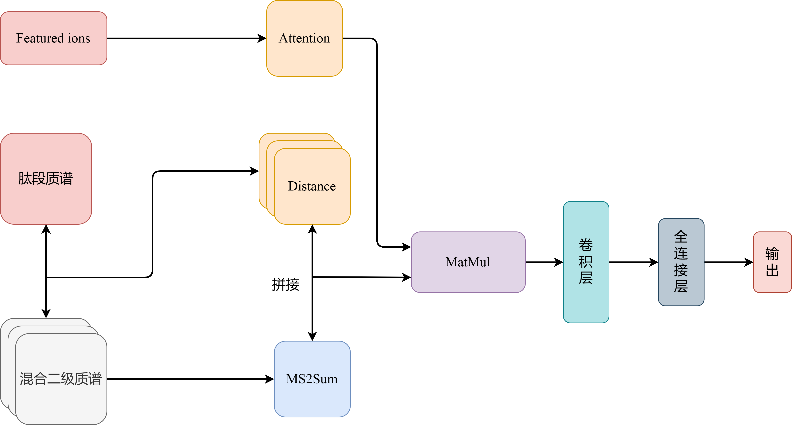
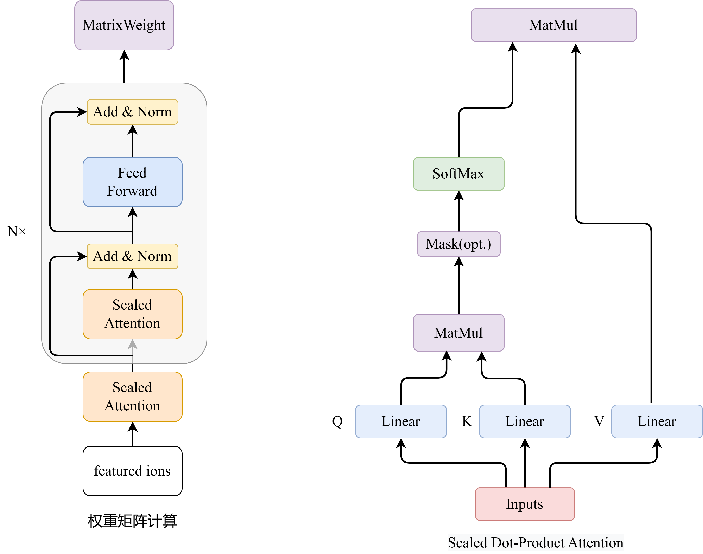

# The-featured-irons-Model-for-DIA-Data

## 1.1 identify Model structure diagram

## 1.2 Self-Attention

We referenced the self-Attention module from the Transformer which was proposed in the paper "Attention is all you need"

